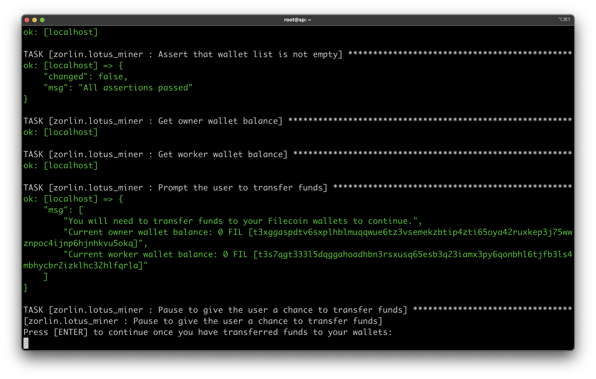
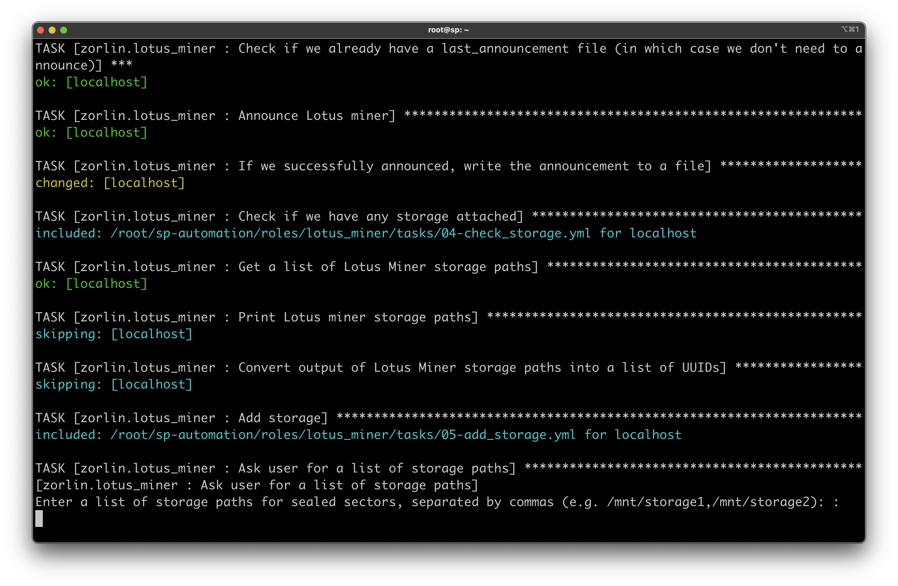
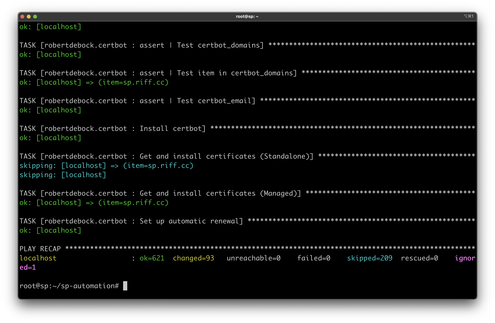

# Deploying an SP with the SP Automation Stack

Thanks for checking out the SP Automation Stack! This is a guide intended for early adopters to try out the Stack and give feedback.

It's based on the v0.1.0 release of the Stack. If newer versions have come out since, this document may be out of date. If you spot any issues, let us know and we'll fix them!

## Getting started

Generally speaking, follow the README's directions to get your environment and required dependencies set up. This guide will give you a bit more detail.

### Setting your settings!

We have a huge amount of customisation abilities built into the SP Automation Stack, with more to come! Here's a few tips to get you started.

#### Inventory

The inventory file is where you define which servers will perform what roles in your SP's infrastructure.

For the initial launch of the MVP, we officially support only a single-node installation, but the code is designed to scale out to SPs of unlimited sizes with everything split into discrete roles - if you are brave, feel free to try it and let us know what does and doesn't work properly!

##### group_vars/all

The "all" variables file contains the vast majority of the variables in use in the SP Automation Stack, and you'll want to pay close attention to it.

The things you will likely want to change here are as follows:

* Set `certbot_email` to a valid email address under your control.
* Set all `*_bind_interface` variables to match your server's primary network interface (or the one you wish to use for that particular role).
* Set `sp_domain` to a subdomain (or domain!) that points directly at your SP's public IPv4 address - specifically, the domain you wish to use for Booster HTTP Retrievals.
* (Advanced) If you are using your own IPFS Gateway for parameter fetching, set ipfs_gateway to the full path to your IPFS Gateway *without* a trailing slash - eg: `ipfs_gateway: "http://localhost:8082"`

Additionally, if you are using a NVIDIA GPU in your environment, you will want to set install_nvidia_driver to "true". If you're planning to use a multi-node installation (recommended), however, see [this issue](https://github.com/filecoin-project/sp-automation/issues/31) as it may affect your installation until fixed.

#### group_vars/yugabytedb

For the initial installation, you won't need to change much here - simply set `yugabyte_bind_interface` as appropriate. We _**highly**_ recommend setting `boost_yugabytedb_superuser` details once you are finished with your initial deployment.

##### group_vars/boost

Most users will not need to change these setings.

### Performing your first run!

Now that your configuration is set, you're just about ready to deploy your SP for the first time using the Stack. Make a copy of your group_vars somewhere safe, then get ready to deploy. 

Note: We suggest runnning Ansible itself in `tmux` or `screen` so that it will keep running if you close your terminal window or SSH session.

Once you're ready, `cd` into the playbook directory, and run

`ansible-playbook deploy.yml` (adding --ask-become-pass if your SP nodes do not use "passwordless sudo")

#### Adding funds

After a few minutes, the playbook will pause and display your new wallet addresses, giving you a chance to transfer funds to them.



Send [tFIL](https://faucet.calibration.fildev.network/funds.html) to those two wallets if you are deploying on calibnet (the default) or FIL if you are deploying on mainnet.

Wait about 30-45 seconds, then hit [ENTER] to proceed. If the transactions haven't been confirmed and picked up by your Lotus Daemon yet, you'll see the same screen repeated. Repeat the process carefully until the playbook continues successfully.

#### Downloading proof parameters

Shortly after adding funds, we'll attempt to download the Filecoin Proof Parameters, which are over 130GiB in size as of this writing.

```
TASK [zorlin.lotus_miner : Download proof parameters] ********************************************************
```

You'll see a repeating message similar to "ASYNC POLL on HOSTNAME: jid=j839748939755.120465 started=1 finished=0" until the download completes.

You may find it useful to speed up this process for future Lotus nodes by setting the `ipfs_gateway` variable in `group_vars/all` to an IPFS gateway on your local network - this will allow you to effectively "cache" the fetching of parameters. Especially usefully, if your IPFS node participates in the IPFS Collab Cluster for Filecoin, it will have all the parameters downloaded already, and will pass them through to your Lotus node very quickly.

#### Defining storage parameters

Finally, the playbook will ask you for a list of storage paths, separated by commas.



These will be for storing your **sealed sectors** and should be on reliable, fault-tolerant storage such as a ZFS pool, CephFS or MooseFS filesystem.

Type out the storage paths you want to add, using commas to separate them as needed (or no comma if listing a single storage path)

### Sealing your first sector and testing Booster retrievals

Upon full deployment of the SP Stack, we recommend you pledge and seal a sector at least once on calibrationnet in order to fully test your sealing pipeline.

You can do this by going to your Lotus miner and issuing the command:

`lotus-miner sectors pledge`

This will cause a new sector to appear, full of random data, and travel through your sealing pipeline.

If you're interested in testing Booster retrievals, now is a great time to do using Snap Deals:

* Create a deal in Boost with a valid CID, ideally in the form of a directory with files in it. Do not publish the deal yet.
* Follow the directions in https://lotus.filecoin.io/storage-providers/operate/snap-deals/ to make your sealed sector valid for receiving snap deals.
* Snap the deal into the sector, wait for it to fully reseal, then attempt to retrieve it from your SP (https://your.sp.domain/ipfs/CID)

### Finishing up

If all went well, you should have a fully functional Filecoin Storage Provider! Congratulations.

Either way, you should see a report from Ansible explaining how much work it did/what changed:



```
PLAY RECAP ***************************************************************************************************
localhost                  : ok=621  changed=93   unreachable=0    failed=0    skipped=209  rescued=0    ignored=1
```

Once your SP is fully installed and configured, future runs will usually take less than 3 minutes and report no changes (or one change if you are using our automation to deploy the NVIDIA drivers, as there is an idempotency bug yet to be solved).

## Going mainnet

Once you're confident your hardware and software are ready to go, it's time to "go mainnet"!

We recommend cleaning up your SP first (you can use [Mr Filecrush](https://github.com/Zorlin/mrfilecrush) to do this, VERY carefully!) and removing all the calibnet configuration. The playbook will actually attempt to do this for you when you switch from calibnet to mainnet (recompiling binaries and such) but currently does not handle Boost, so ask Mr Filecrush for a hand.

Once you're ready, open `group_vars/all` and change:

* `use_calibrationnet` to "false"
* `ready_for_mainnet` to "true"

Now when you re-run the playbook, everything will be built and configured for mainnet. Welcome to the network!

## Upgrades

Remember to read the release notes for each new version of the SP Automation Stack - you will need to adjust your group_vars/ files to keep up with changes to the playbook, and make other changes the release notes will describe to you.

## Power user tweaks

You can optionally set some power user tweaks. We recommend you change these only if you understand both what these tweaks do and why you might want to use them.

```
### Power user tweaks, use with caution! ###
# Driver and kernel upgrade controls. Note that freezing the driver version does not necessarily prevent kernel upgrades from being possible.
# Freeze kernel version to prevent automatic kernel upgrades.
power_freeze_kernel: false
# Freeze NVIDIA drivers to prevent automatic driver upgrades.
power_freeze_nvidia_drivers: false
```

Edit the tweaks in `group_vars/all` and re-run the playbook to apply them. Note that there's not currently an automated way to _undo_ the tweaks - but you know what you're doing, right? 😁


